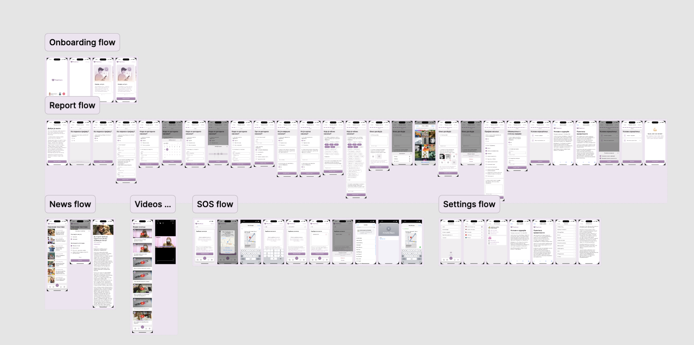
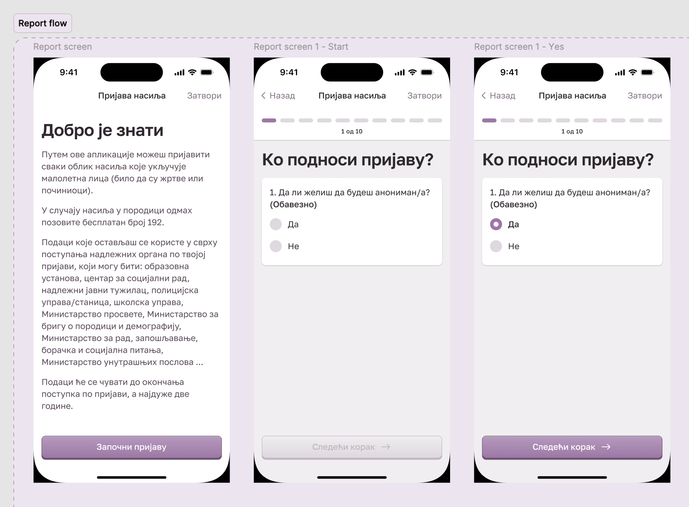

# TihiHeroj

**TihiHeroj** is a SwiftUI-based mobile application designed to allow users in Serbia to **anonymously report violence**. The app enables users to submit detailed incident reports, share their location, and upload supporting evidence—all with a focus on privacy and safety.

This project was developed as part of a SwiftyLabs course, in collaboration with the **City of Vranje** and **KZM Vranje**.(Office for Young People)  
> ⚠️ *Note: This repository does not contain the full source code, as it was exported from an Xcode project. However, you can view the full app flow in the demo video.*

---

## 🚀 Features

- 🔒 **Anonymous reporting** with a complete questionnaire
- ☁️ **Firebase integration** for secure data storage and real-time updates
- 📰 **Educational content** – news, articles, and videos on violence prevention
- 🌐 **Multi-language support**
- 📍 **Location services** to help pinpoint where incidents occurred
- 👤 **Contact handling** for submitting reports involving others
- 🎨 **Modern UI/UX design** built with SwiftUI

---

## 🛠️ Technologies Used

- **SwiftUI** – Apple's modern declarative UI framework
- **Firebase** – used for:
  - Realtime Database / Firestore
  - Authentication
  - Storage for evidence (images/videos)
  - Hosting and backend logic
- **CoreLocation** – to get user’s location for reports
- **Localizable.strings** – for internationalization and language support

---

## 📸 Screenshots / Demo
## 🎥 Demo Video

You can view the full user flow and demonstration in this video:  
📎 [Watch the Video Demo on Vimeo](https://vimeo.com/1106608482)

---

## 🎨 App Design Preview

Here’s the full UI flow from Figma:

